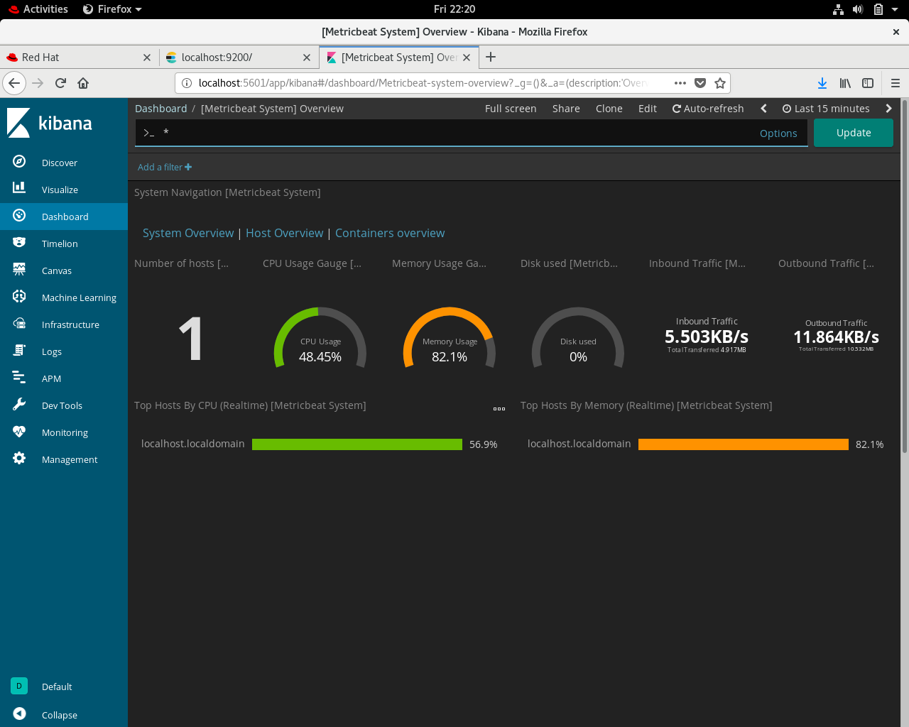
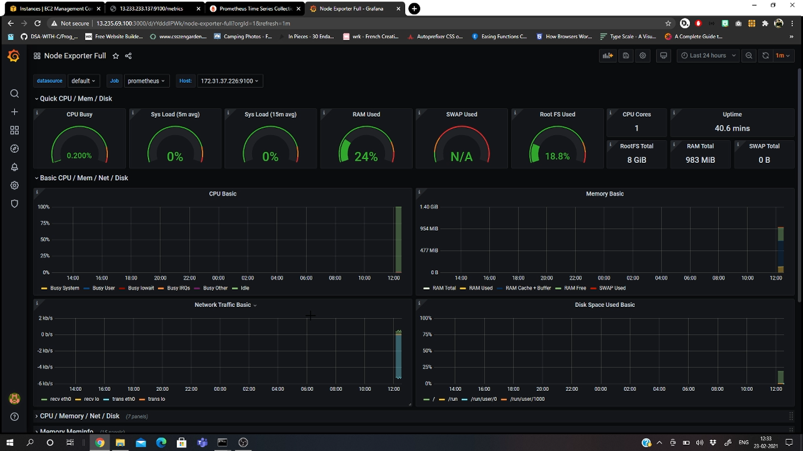

# Zenatix
## Zenatix Solutions Assignment - Montoring Local Machine with Elastic Search and Kibana

### 1. Clone Repository

### 2. Project Set-Up - Change to cloned directory.

```

docker-compose up

```
### 3. Check for servers up and running.

```

docker-compose ps

```

### 4. Check Kibana Server running on http://localhost:5601

### 5. Go to terminal and run zenatix.py

```

python zenatix.py

```

### 6. Check indices for ElasticSearch.

```

curl -X GET "http://localhost:9200/_cat/indices?v"

```

### 7. Open Kibana Server again- Connect to index 'metrics' and play with the dashboard.
<br>
<br>

## Same but more effective solution with MetricBeat.
<br>

### 1. Download, install and configure MetricBeat according to your system requirements :- [MetricBeat Setup](https://www.elastic.co/guide/en/beats/metricbeat/current/metricbeat-installation-configuration.html)

### 2. Check your configuration.
```

sudo metricbeat test output

```

### 3. Enable and start the service of MetricBeat.

```

sudo metricbeat setup

```

```

sudo systemctl start metricbeat

```
### 4. Go to Kibana Server http://localhost:5601/app/kibana/  > Metrics > Add Metrics Data > Module Status > Click on Check Data > Click on System Metrics Dashboard
<br>

### 5. Results
<br>
<br>


<br>
<br>

### 6. Same solution with Prometheus and Grafana servers over AWS Cloud.
<br>
<br>

<br>
<br>


